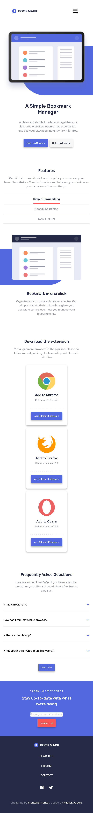

# Frontend Mentor - Bookmark landing page solution

This is a solution to the [Bookmark landing page challenge on Frontend Mentor](https://www.frontendmentor.io/challenges/bookmark-landing-page-5d0b588a9edda32581d29158). Frontend Mentor challenges help you improve your coding skills by building realistic projects.

## Table of contents

- [Overview](#overview)
  - [The challenge](#the-challenge)
  - [Screenshot](#screenshot)
  - [Links](#links)
- [My process](#my-process)
  - [Built with](#built-with)
  - [What I learned](#what-i-learned)
  - [Continued development](#continued-development)
  - [Useful resources](#useful-resources)
- [Author](#author)

## Overview

### The challenge

Users should be able to:

- View the optimal layout for the site depending on their device's screen size
- See hover states for all interactive elements on the page
- Receive an error message when the newsletter form is submitted if:
  - The input field is empty
  - The email address is not formatted correctly

### Screenshot

```
Desktop View
```


```
Mobile View
```



### Links

- Live Site URL: [Bookmark Landing Page](https://bookmark-landing-pj.netlify.app/)

## My process

### Built with

- Semantic HTML5 markup
- CSS custom properties
- Flexbox
- CSS Grid
- CSS Positioning
- Mobile-first workflow

### What I learned

Use this section to recap over some of your major learnings while working through this project. Writing these out and providing code samples of areas you want to highlight is a great way to reinforce your own knowledge.

To see how you can add code snippets, see below:

```html
<button class="cta" data-type="inverted">Get it on Firefox</button>
```

```html
<button class="tab-btn active" data-id="tab-1">Simple Bookmarking</button>
<div class="content active" id="tab-1">
  <div class="content-container">
    <div class="tab-img">
      
    </div>
    <div class="tab-text">
      <h1 class="primary-heading">Bookmark in one click</h1>
      <p>
        Organize your bookmarks however you like. Our simple drag-and-drop
        interface gives you complete control over how you manage your favourite
        sites.
      </p>
      <a class="cta hide" href="#">More Info</a>
    </div>
  </div>
</div>
```

```html
<hr class="hr" />
```

```css
--clr-neutral-100: hsl(0, 0%, 100%);
--clr-neutral-200: hsl(0, 0%, 97%);
```

```css
.container {
  padding-block: var(--size-700);
  margin: var(--size-450);
}
```

```css
.logo .circle-fill {
  fill: var(--clr-primary-600);
}
.logo .path-fill {
  fill: var(--clr-neutral-100);
}
```

```css
.hero__image::before {
  width: 86%;
  border-top-left-radius: 100vmax;
  border-bottom-left-radius: 100vmax;
  bottom: -20px;
  left: 20%;
}
```

```css
.cta[data-type="inverted"]:hover {
  background-color: var(--clr-neutral-100);
  color: var(--clr-neutral-600);
  border: 1px solid var(--clr-neutral-600);
  box-shadow: none;
}
```

```css
.question:last-of-type {
  margin-bottom: var(--size-700);
}
```

```css
.card-one {
  align-self: flex-start;
}
.card-two {
  align-self: center;
}
.card-three {
  align-self: flex-end;
}
```

```js
const close = () => {
  navList.style.top = "-100%";
  openMenu.style.visibility = "visible";
  logoText.style.color = "hsl(229, 31%, 21%)";
  logoCircle.style.color = "hsl(231, 69%, 60%)";
};
```

### Continued development

- Form Submission error messages
- Nesting of HTML 5 Elements
- Responsive Web development

### Useful resources

- [CSS Resets](https://andy-bell.co.uk/a-modern-css-reset/) - This helped me to "reset" or "normalize" the default styles applied by web browsers to HTML elements. It created a consistent base styling across all browsers and devices, which can made it easier to build a custom design without being affected by default browser styles.I really liked this pattern and will use it going forward.
- [CSS Flex & Grid](https://shrutibalasa.gumroad.com/l/css-flex-and-grid) - This is an amazing book which helped me finally understand build components and layouts with CSS Flexboc and Grid. I'd recommend it to anyone still learning this concept.
- [CSS Variables and CSS Concepts](https://www.youtube.com/@KevinPowell) - This is channel helped me to understand css variables and other css concepts. It helped me to fall in love with CSS.

## Author

- Website - [Patrick Juawo](https://www.your-site.com)
- Frontend Mentor - [@yourusername](https://www.frontendmentor.io/profile/yourusername)
- Twitter - [@pjuawo](https://www.twitter.com/pjuawo)
- Facebook - [@pjuawo](https://www.facebook.com/pjuawo)
